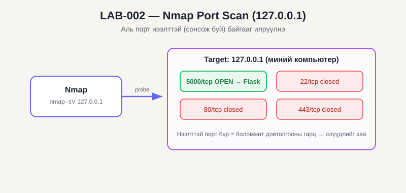

# LAB-002 — Nmap Localhost Scan (Recon / Network Security)

| Талбар | Утга |
|---|---|
| **LAB ID** | LAB-002 |
| **Domain** | Network Security → Reconnaissance |
| **Roadmap topic** | Common ports, Nmap, port scanning |
| **Difficulty** | Easy |
| **Estimated time** | ~1 цаг |
| **Status** | NOT STARTED |

## 🖼️ Диаграм ба товч тайлбар


**Монгол тайлбар:** Nmap нь target хаяг руу (энд өөрийн 127.0.0.1) олон портод хүсэлт (probe) илгээж, аль нь **нээлттэй (OPEN)**, аль нь хаалттай болохыг хэлж өгдөг. Dashboard асаалттай үед 5000 порт нээлттэй харагдана, унтраавал хаагдана. Нээлттэй порт бүр нь үйлчилгээ ажиллаж буйг, мөн боломжит довтолгооны гарцыг илтгэдэг. *(Ойлголтын диаграм — нотолгоо нь таны screenshot.)*

## 🎯 OBJECTIVE
Nmap-аар **өөрийн компьютерийн (127.0.0.1)** нээлттэй портуудыг илрүүлж, тэнд ямар үйлчилгээ ажиллаж байгааг тодорхойлох. Port scanning гэж юу болох, хэрхэн ажилладгийг ойлгох.

## 🖥️ ENVIRONMENT
- Өөрийн Windows компьютер (эсвэл Kali/Ubuntu VM)
- **Nmap:** https://nmap.org/download.html
- Target: **зөвхөн 127.0.0.1 (localhost)** эсвэл өөрийн VM-ийн IP

## 🔒 SCOPE
**ЗӨВХӨН өөрийн машин/VM-ээ скан хийнэ.** Бусдын IP, байгууллага, интернэт дэх санамсаргүй хостыг скан хийхгүй — зөвшөөрөлгүй скан хийх нь олон улсад хууль зөрчинө. Localhost бол 100% аюулгүй.

## 📖 THEORY
- **Port scan:** аль порт нээлттэй (сонсож буй) байгааг шалгана
- **TCP SYN scan (`-sS`):** хагас холболт — хурдан, нам дуу
- **Service/version (`-sV`):** портод ямар програм, ямар хувилбар ажиллаж байгааг таамаглана
- Нийтлэг порт: 22=SSH, 80=HTTP, 443=HTTPS, 3389=RDP, 5000=миний Flask app

## ⚙️ PROCEDURE
1. Nmap суулгах.
2. Эхлээд dashboard-оо асаа (нээлттэй порт үүсгэхийн тулд):
   ```
   cd C:\Users\yalguunjargal.j\cyber-labs\04-dashboard
   python app.py
   ```
3. Шинэ терминалд энгийн скан:
   ```
   nmap 127.0.0.1
   ```
   📸 **Screenshot:** нээлттэй портын жагсаалт → `LAB-002_DATE_basic-scan.png`
4. Үйлчилгээ/хувилбар илрүүлэх:
   ```
   nmap -sV 127.0.0.1
   ```
5. Тодорхой порт шалгах:
   ```
   nmap -p 5000 127.0.0.1
   ```
   📸 **Screenshot:** 5000 портод Flask/Werkzeug харагдах → `LAB-002_DATE_port5000.png`
6. (Сонголттой) Бүх портыг сканнах: `nmap -p- 127.0.0.1`

## ✅ EXPECTED RESULT
- 5000/tcp **open** гэж харагдана (dashboard асаалттай үед)
- `-sV` нь "Werkzeug httpd" эсвэл "Python" гэх мэт тодорхойлно
- Dashboard-оо унтраавал 5000 порт хаагдана (дахин скан хийж баталгаажуул)

## 📊 ACTUAL RESULT
_(бөглөнө)_

## 📎 EVIDENCE
- `06_Evidence/Nmap/LAB-002_DATE_scan.txt` (гаралтыг хадгал: `nmap -sV 127.0.0.1 > scan.txt`)
- Screenshots дээр дурдсан

## 💡 WHAT I LEARNED
_(port scan юу хийдэг, яагаад зөвхөн зөвшөөрөлтэй target скан хийх ёстой)_

## ➡️ NEXT LAB
LAB-003 — VirtualBox isolated lab (дараагийн лабуудад VM хэрэгтэй)

### ✔️ Completion criteria
- [ ] Theory: port/scan ойлгосон
- [ ] Practice: localhost скан хийсэн, 5000 порт илрүүлсэн
- [ ] Evidence: scan гаралт + screenshot
