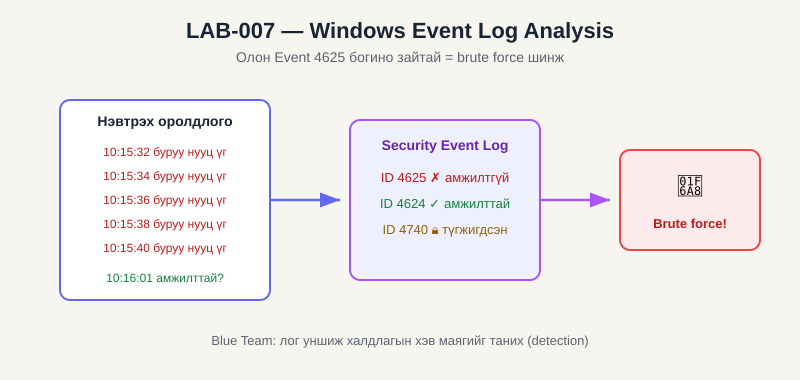

# LAB-007 — Windows Event Log Analysis (Blue Team / Log Analysis)

| Талбар | Утга |
|---|---|
| **LAB ID** | LAB-007 |
| **Domain** | Blue Team → Log Analysis |
| **Roadmap topic** | Windows Event Logs, failed logons, detection |
| **Difficulty** | Medium |
| **Estimated time** | ~1.5 цаг |
| **Status** | NOT STARTED |

## 🖼️ Диаграм ба товч тайлбар


**Монгол тайлбар:** Windows бүх нэвтрэлтийг Security Event Log-д бичдэг: **4625** = амжилтгүй нэвтрэлт, **4624** = амжилттай, **4740** = бүртгэл түгжигдсэн. Хэрэв богино хугацаанд олон 4625 дараалан гарч, дараа нь 4624 ирвэл энэ нь **brute force** халдлагын сонгодог хэв маяг. Blue Team аналист энэ логийг уншиж халдлагыг таньдаг (detection). *(Ойлголтын диаграм.)*

## 🎯 OBJECTIVE
Windows Event Viewer болон PowerShell ашиглан нэвтрэлтийн лог (Event ID 4624 амжилттай, 4625 амжилтгүй) -ийг олж, амжилтгүй нэвтрэлтийн хэв маягийг (brute force шинж) илрүүлж сурах.

## 🖥️ ENVIRONMENT
- Өөрийн Windows компьютер эсвэл Windows VM
- Event Viewer, PowerShell (Administrator)

## 🔒 SCOPE
Зөвхөн өөрийн машины лог. Амжилтгүй нэвтрэлт үүсгэхийн тулд **өөрөө зориуд буруу нууц үгээр** түгжээ/нэвтрэлт оролдоно.

## 📖 THEORY
- **Event ID 4625:** амжилтгүй нэвтрэлт (failed logon)
- **Event ID 4624:** амжилттай нэвтрэлт
- **Event ID 4740:** бүртгэл түгжигдсэн (account lockout)
- Олон 4625 богино хугацаанд → **brute force / password spray** шинж

## ⚙️ PROCEDURE
1. Амжилтгүй нэвтрэлт үүсгэх: `Win+L` → буруу нууц үгээр хэд хэдэн удаа нэвтрэхийг оролдох (өөрийн данс).
2. Event Viewer нээх (`eventvwr.msc`) → Windows Logs → Security.
3. "Filter Current Log" → Event ID: `4625`.
   📸 **Screenshot:** 4625 жагсаалт → `LAB-007_DATE_eventviewer-4625.png`
4. Нэг event дээр дарж дэлгэрэнгүйг (account name, source) унших.
5. PowerShell (Admin)-аар тоолох:
   ```powershell
   Get-WinEvent -FilterHashtable @{LogName='Security'; Id=4625} -MaxEvents 50 |
     Select-Object TimeCreated, @{N='User';E={$_.Properties[5].Value}} |
     Format-Table -Auto
   ```
   📸 **Screenshot:** PowerShell гаралт → `LAB-007_DATE_powershell-4625.png`
6. Экспортлох (нотолгоо, LAB-008-д ашиглах):
   ```powershell
   Get-WinEvent -FilterHashtable @{LogName='Security'; Id=4625} -MaxEvents 100 |
     Export-Csv failed_logons.csv -NoTypeInformation
   ```

## ✅ EXPECTED RESULT
- 4625 events таны зориуд үүсгэсэн амжилтгүй оролдлогуудыг харуулна
- Богино хугацаанд олон оролдлого = сэжигтэй хэв маяг

## 📊 ACTUAL RESULT
_(бөглөнө)_

## 📎 EVIDENCE
- Event Viewer + PowerShell screenshots, failed_logons.csv

## 💡 WHAT I LEARNED
_(Event ID-ийн утга, brute force хэрхэн логт харагддаг, SIEM-ийн суурь)_

## ➡️ NEXT LAB
LAB-008 — Failed Login Analyzer (энэ лог/sample-ийг Python-оор автоматаар шинжлэх)

### ✔️ Completion criteria
- [ ] Theory: 4624/4625/4740
- [ ] Practice: 4625 олсон, PowerShell-аар тоолсон, CSV экспортолсон
- [ ] Evidence: 2 screenshot + CSV
