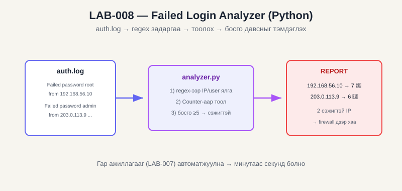

# LAB-008 — Failed Login Analyzer (Python) — Programming / Blue Team

| Талбар | Утга |
|---|---|
| **LAB ID** | LAB-008 |
| **Domain** | Programming → Security Automation / Blue Team |
| **Roadmap topic** | Log parsing, regex, brute-force detection |
| **Difficulty** | Medium |
| **Estimated time** | ~1.5 цаг |
| **Status** | NOT STARTED |

## 🖼️ Диаграм ба товч тайлбар


**Монгол тайлбар:** Python скрипт нь auth.log-ийг уншиж, **regex**-ээр IP болон хэрэглэгчийг ялгаж авдаг, **Counter**-аар давтамжийг тоолдог, дараа нь **босго** (≥5) давсан IP-г brute-force сэжигтэй гэж тэмдэглэдэг. Жишээ лог дээр 192.168.56.10 (7) ба 203.0.113.9 (6) хоёрыг илрүүлнэ. Энэ нь LAB-007-ийн гар ажиллагааг автоматжуулж, мянган мөрийг секундэд шинжилнэ. *(Ойлголтын диаграм.)*

## 🎯 OBJECTIVE
Python-оор auth.log-ийг автоматаар уншиж, амжилтгүй нэвтрэлтийг IP/хэрэглэгчээр бүлэглэн, brute-force сэжигтэй эх сурвалжийг илрүүлэх хэрэгсэл бичих. Гар ажиллагааг (LAB-007) автоматжуулах.

## 🖥️ ENVIRONMENT
- Python 3 (аль ч OS)
- Файлууд: `failed_login_analyzer.py`, `sample_auth.log` (энэ фолдерт бэлэн)

## 🔒 SCOPE
Зөвхөн сургалтын sample лог эсвэл өөрийн экспортолсон лог (LAB-007-ийн CSV/log).

## 📖 THEORY
- **Regex:** лог мөрнөөс IP, хэрэглэгчийг ялгаж авах
- **Counter:** давтамжийг тоолох
- **Threshold detection:** босго давсан эх сурвалжийг "сэжигтэй" гэж тэмдэглэх — энгийн detection engineering

## ⚙️ PROCEDURE
1. Кодыг нэг бүрчлэн уншиж ойлгох (`LINE_RE` regex, `analyze()`, босго).
2. Sample лог дээр ажиллуулах:
   ```
   python failed_login_analyzer.py sample_auth.log
   ```
   📸 **Screenshot:** тайлан, brute-force илрүүлсэн → `LAB-008_DATE_analyzer-output.png`
3. Босго өөрчилж туршах:
   ```
   python failed_login_analyzer.py sample_auth.log --threshold 3
   ```
4. (Холбоос) LAB-007-д экспортолсон бодит логоо (Linux auth.log эсвэл хөрвүүлсэн) оруулж туршах.
5. (Сайжруулалт — сонголттой) Цагийн цонх (нэг минутад N удаа) нэмж "хурдан" brute force-ийг ялгах.

## ✅ EXPECTED RESULT
- Нийт амжилтгүй: 14
- 192.168.56.10 (7) ба 203.0.113.9 (6) → BRUTE FORCE сэжигтэй гэж тэмдэглэнэ
- `--threshold 3` үед илүү олон IP сэжигтэй болно

## 📊 ACTUAL RESULT
_(бөглөнө)_

## 📎 EVIDENCE
- analyzer-output screenshot
- (сонголттой) өөрийн кодын өөрчлөлт

## 💡 WHAT I LEARNED
_(regex-ээр лог задлах, threshold detection, автоматжуулалт яагаад чухал)_

## ➡️ NEXT LAB
LAB-009 — Web security (OWASP Juice Shop)

### ✔️ Completion criteria
- [ ] Theory: regex, counting, threshold detection
- [ ] Practice: script ажиллуулсан, босго өөрчилж туршсан
- [ ] Evidence: гаралтын screenshot
